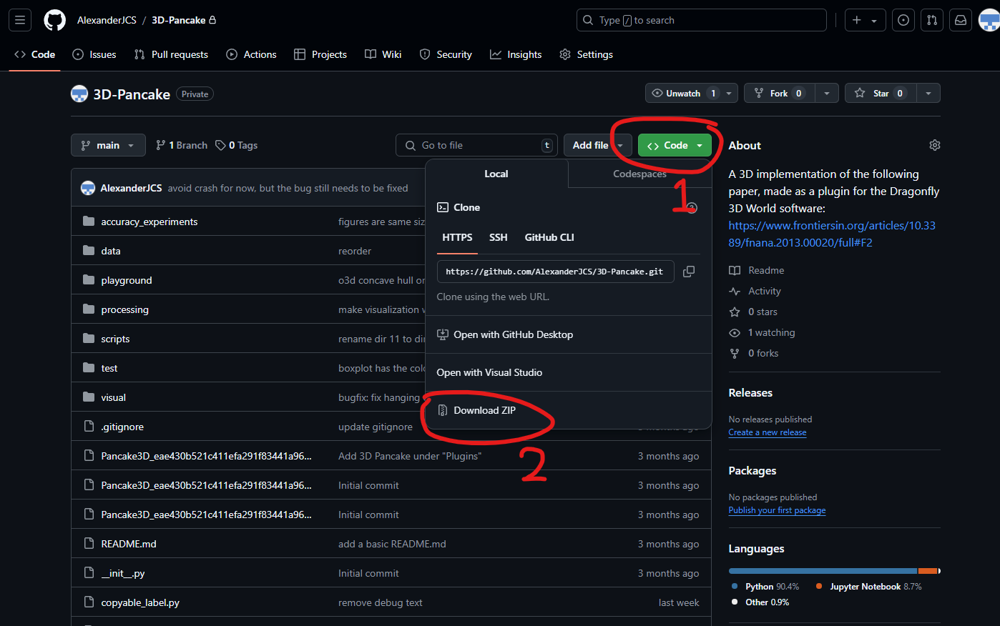
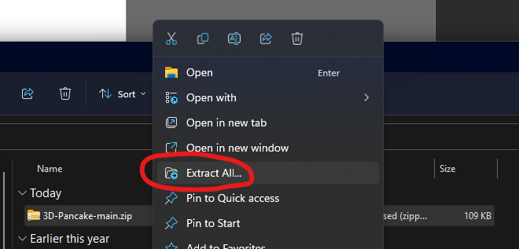
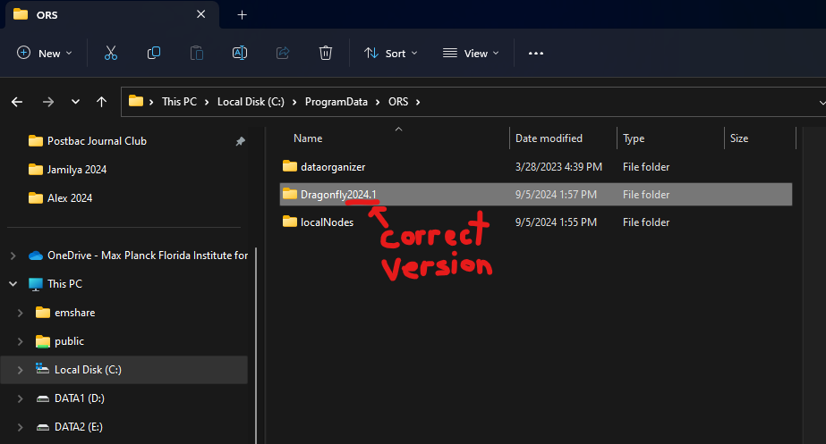
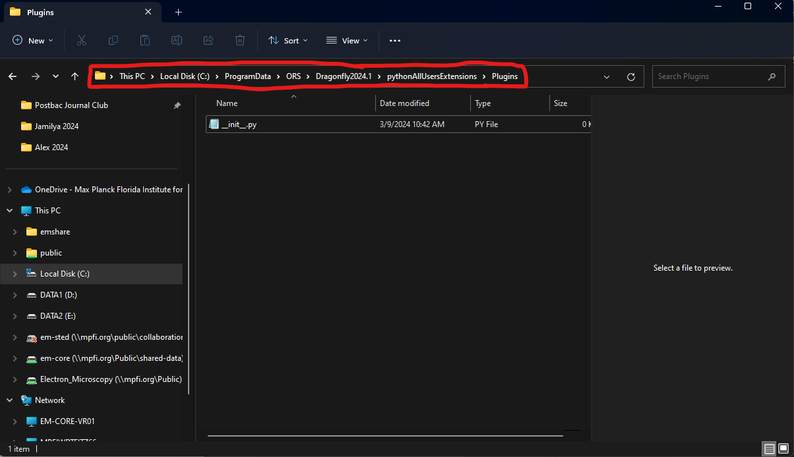
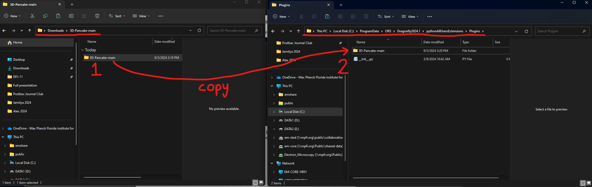
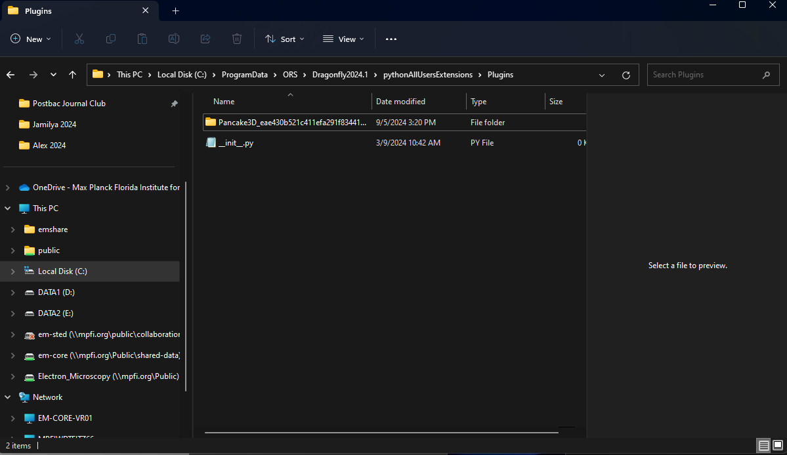
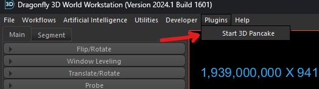
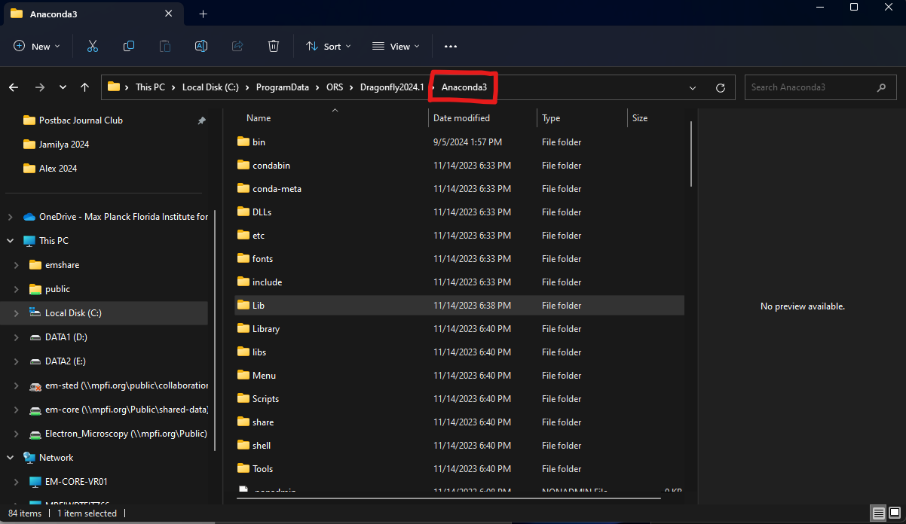
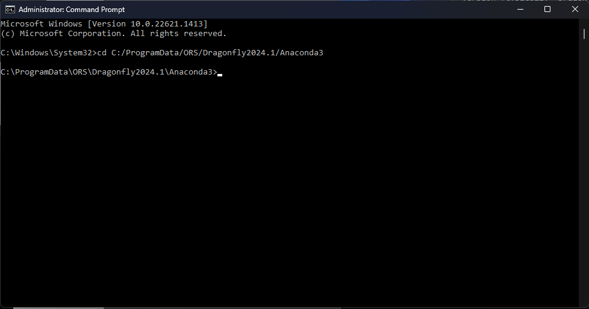
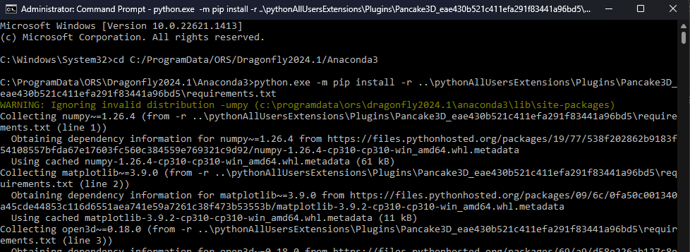

# 3D Pancake Installation Instructions

**Written by Alexander Castronovo** on 9/5/2024 at the Electron
Microscopy Core, Max Planck Florida Institute for Neuroscience

**The 3D Pancake plugin is designed for Dragonfly version 2024.1.** It
will not work on earlier versions and may not work on later versions.

If you have any problems with the installation, please contact Alex or create a GitHub issue.

## Step-by-step instructions

**Step 1:** Close Dragonfly

**Step 2**: Go to <https://www.github.com/alexanderjcs/3d-pancake>

**Step 3:** Click on the "Code" button -\> Download Zip



**Step 4:** Go to the downloads folder and extract the zip file



**Step 5:** In a new File Explorer window, navigate to
`C:/ProgramData/ORS` and find the folder containing your Dragonfly
version (typically `Dragonfly[YOUR_VERSION]`)



**Step 6:** Go into the Dragonfly folder for your version -\>
pythonAllUserExtensions -\> Plugins. (The entire path should look like
`C:/ProgramData/ORS/Dragonfly/[YOUR_VERSION]/pythonAllUsersExtensions/Plugins`)



**Step 7**: Drag and drop the folder extracted in step 4 into the
Plugins folder. Note: The extracted folder contains another folder
inside it. Make sure to drag the inner folder, not the outer one.



**Step 8:** Rename the folder to
`Pancake3D_eae430b521c411efa291f83441a96bd5`



### Breakpoint: Check that everything works so far

Launch Dragonfly. On the top bar, you should see a new "Plugins" tab.
Within that tab, you should see "Start 3D Pancake". When you click it,
nothing should happen since installation is not fully complete.



If you do not see the "Plugins" tab or "Start 3D Pancake", follow the
below troubleshooting steps:

**In step 7**, verify you dragged the inner folder (in 3D-Pancake-main)
instead of the outer folder (in Downloads).

**In step 8**, if the folder name is incorrect, the button will not
show.

### Installation Final Steps

**Step 9:** Close Dragonfly

**Step 10:** Go to `C:/ProgramData/ORS` -> your Dragonfly installation
-\> `Anaconda3` and copy the filepath



**Step 11:** Open command prompt as **administrator** and run
the command:

```sh
cd [Anaconda_Filepath_From_Previous_Step]
```

Replace the brackets and content inside with the file path in you
copied.



**Step 12:** In your current command prompt window, run the following
command to install all libraries required by 3D Pancake. This may take a
couple of minutes to complete.

```sh
python.exe --m pip install --r ../pythonAllUsersExtensions/Plugins/Pancake3D_eae430b521c411efa291f83441a96bd5/requirements.txt
```



You may get a few warnings, but as long as there are no errors, you can
ignore them.

**Step 13:** Open Dragonfly and test that the plugin opens. If it does,
the installation is complete.
