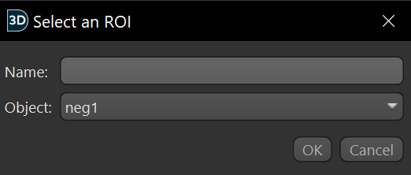

# Usage Guide

This guide will explain how to use the 3D pancake software plugin.

## Example: Analyzing a PSD

This section is a guide on how to analyze a single PSD using 3D Pancake. By following along, you will gain a general idea of how to use the plugin.

Before continuing with this section, please have a segmentation of a PSD as a single ROI prepared.

## Open the 3D Pancake user interface
In the toolbar, click Plugins -> Start 3D Pancake.

### Select the PSD to analyze
In the 3D Pancake interface, select "Select Single PSD". This will open a dialog box to select the PSD to analyze. Simply select the PSD and click OK; the name field is ignored.

Now, everything needed for PSD processing should be complete. All other parameters are optional, but can be used for more advanced analysis.

### Run analysis

Now, the analysis can be run by clicking the "Process" button. When processing is complete, it will show the PSD surface area under the button. If multiple PSDs are being processed, it will only show a generalized success message.

### Proofreading the output

Now that we have the surface area, we need to verify that the surface area measurement is accurate. 3D Pancake works by creating a mesh that closely follows the morphology of the PSD. This mesh can be viewed in Dragonfly to verify that the surface area is accurate.

To enable the mesh output, click the "Generate a Dragonfly Mesh" checkbox under the "Output" section.

Then, click the "Process" button. Everything should look the same, but now there should be a new Dragonfly object in the object list in the top right of the screen. This object will be named `3D Pancake Output Mesh: ` followed by the name of the PSD. Click on the eye to view the mesh in 2D.

Now, you should see a mesh that follows the PSD segmentation, like this:

For this section, the correctness (how closely the mesh follows the PSD morphology) of the mesh does not matter. For real analysis, the [cs parameter](#cs-blur-constant) or the [vertex deletion threshold](#Vertex-Deletion-Threshold) may need to be adjusted to get a more accurate mesh.

### Save the output

3D Pancake offers a convenient method to save the output of the analysis in a CSV file. To do this, enter the desired filename in the "CSV File Name" field. Then click the "Select Output Folder" button to select the output folder (I am using my desktop).

Before clicking the "Process" button, uncheck "Generate a Dragonfly Mesh" from the prior step to avoid creating two meshes.

Finally, click the "Process" button to run the analysis. When the analysis is complete, a CSV file will be saved to the specified location.

If there was a previous file at that location, it will be overwritten. If the previous file is open, 3D Pancake will not be able to overwrite it.

### Conclusion

This concludes the basic analysis of a PSD with 3D Pancake. The surface area of the PSD has been calculated, and the output has been saved to a CSV file. The mesh output has been viewed in Dragonfly to verify the accuracy of the surface area measurement.

Any parameter in the user interface is explained in more detail in the [Configuration](#Configuration) section. For a deeper understanding on how to use 3D Pancake, it is recommended to read the section.

The same analysis that was done here with one PSD can be done with multiple PSDs by using the "Select Multiple PSDs" button instead of "Select Single PSD" in the 3D Pancake user interface.

## Configuration

This section will explain all the configuration options shown in the 3D Pancake user interface in detail, how they affect the output, and when they should be adjusted.

### Parameters Section

#### cs (blur constant)

The cs parameter determines how tightly the output mesh matches the morphology of the PSD. Lower cs values create a tighter fit and higher cs values create a looser fit. If set too low, the output mesh will be too bumpy and the surface area value will be artificially inflated. If set too high, the output mesh will not follow the PSD morphology close enough. The cs parameter often needs to be adjusted when proofreading the plugin's output depending on the size, shape, and complexity of the PSD.

As a general rule of thumb, the cs parameter should not go below 0.15 or above 0.7, with a cs between 0.2 to 0.3 working best for most PSDs.

If you understand the internals of 3D Pancake, you would recognize cs as the constant that scales the gaussian blur standard deviation of the distance map.

#### Vertex Deletion Threshold

The vertex deletion threshold specifies the distance from the original segmentation where mesh vertices will be deleted. This is an important step in the surface area calculation and, among other things, adds perforations to the mesh.

By default, the vertex deletion threshold value is half the z-layer thickness of the segmentation. The z-axis is chosen because it is usually the thickest axis serial block face scanning electron microscopy (SBF-SEM). To use the default value, keep the text box empty.

For simple PSDs, this parameter usually does not need to be adjusted.

The threshold should be set higher if:
* Perforations in the mesh are appearing that likely do not actually exist (e.g. in between z-slices).

The threshold should be set lower if:
* Medium-sized and large perforations in the PSD are filled in by the mesh.
* The mesh is going over the edge of the segmentation too much.

It is recommended to verify these issues in 2D and 3D, the 2D visualization of a mesh is sometimes misleading.

### Output Section

#### CSV File Output

The text boxes "CSV File Name", "Output Filepath", and "Select Output Folder" allow you to select the file location of an output CSV file. This is useful for saving and analyzing surface area results of 3D Pancake, especially when processing in bulk.

A CSV file output will only be generated if the "Output Filepath" field contains a valid filepath. Please note that (a) any previous file at that filepath **will be overwritten** (b) 3D Pancake will not overwrite the output file if it is open in another program (such as Excel or Notepad).

It is recommended to not modify the "Output Filepath" field (unless you are copy/pasting a filepath), since the "CSV File Name" field and "Select Output Folder" will do that automatically.

#### Output Dragonfly Mesh

This checkbox enables the output of a Dragonfly mesh. This is very useful when it comes to proofreading and ensuring the 3D Pancake output is accurate. Meshes can be viewed in 2D as well as 3D. The Dragonfly meshes it outputs are accessible in the list of Dragonfly objects in the top right of the screen.

The output meshes will always start with `3D Pancake Output Mesh: ` before the name of the PSD (if processing a single PSD through an ROI) or the PSD's label ID (if processing multiple PSDs through a MultiROI)

### Input Section

#### Select Single PSD

Pressing the "Select Single PSD" button will open a new dialog box.

**The name parameter is ignored; it is recommended to keep it empty.**

Select the ROI to process under "Object", then click OK. Single PSDs must be in the format of ROIs. Multiple PSDs under one ROI segmentation may cause unexpected behavior or the program to stall.

#### Select Multiple PSDs

This opens a dialog box very similar to the single PSD selection box, and works largely the same. The key difference is that it enables the selection of MultiROIs instead of single ROIs. Selecting a MultiROI will process all items of the MultiROI in bulk.

### Debug Section

This section contains several flags used for debugging purposes. It is not recommended to enable these unless you need much more detail about the steps the 3D Pancake algorithm is taking.

#### Visualize Steps

Visualizes all steps of the 3D Pancake algorithm in a separate window. Enabling this is not recommended for MultiROIs since it opens several windows for each PSD, so processing a large MultiROI dataset with this enabled will cause dozens of windows to open that will manually need to be closed.

Even when running with a single PSD, several windows may show at once. Only the most recently-opened window can be interacted with. To interact with a different window, close all windows until the one you want is the last one remaining.

#### Visualize Final Step

This flag does the same thing as visualize all steps, but only opens the window for the final step. This reduces window clutter that may occur when "Visualize Steps" is checked.

#### Compare to Lewiner 2012

Only changes the output when outputting to a CSV. Adds another column that gives the surface area from the [Lewiner 2012](https://doi.org/10.1080/10867651.2003.10487582) (improved marching cubes) method. Comparing 3D Pancake's surface area to Lewiner 2012's surface area may help  identify PSDs that have a very inaccurate surface area.

#### Compare to Lindblad 2005

Similar to the "Compare to Lewiner 2012" flag, but with the [Lindblad 2005](https://dx.doi.org/10.1016/j.imavis.2004.06.012) method instead. 
