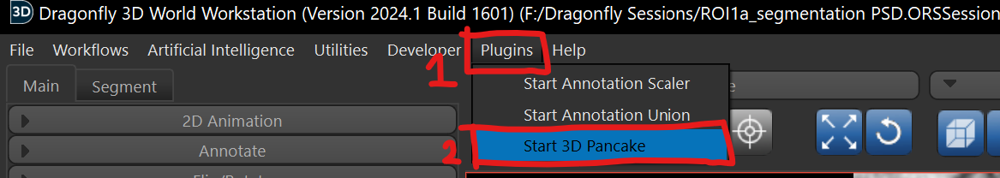
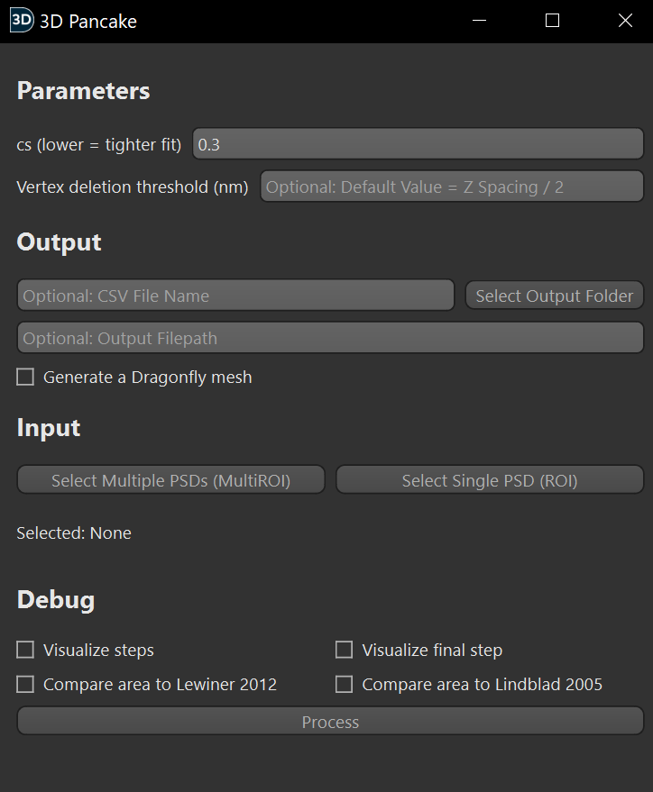
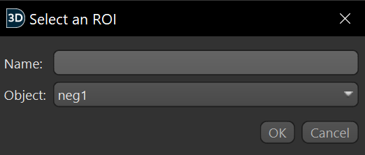

# Usage Guide

This guide will explain how to use the 3D pancake software plugin.

This guide is written by Alexander Castronovo on Jan 7, 2025 at the Max Planck Florida Institute for Neuroscience.

## Usage Instructions

First, open the Dragonfly session containing data to analyze. This guide already assumes that the postsynaptic densities (PSDs) are segmented as either MultiROIs or single ROIs.

## Opening the Plugin UI

To open the plugin, go to Plugins -> Start 3D Pancake in the Dragonfly toolbar. Don't worry if you see the other plugin options; they are not used in this tutorial.

Then, you should see this window appear:

## Configuration

This section will explain the configuration options shown in the 3D Pancake user interface. The information from this section will be used to run analysis of your first PSD in the next section of this tutorial. 

### Parameters Section

#### cs (blur constant)

The cs parameter determines how tightly the output mesh matches the morphology of the PSD. Lower cs values create a tighter fit and higher cs values create a looser fit. If set too low, the output mesh will be too bumpy and the surface area value will be artificially inflated. If set too high, the output mesh will not follow the PSD morphology close enough. The cs parameter often needs to be adjusted when proofreading the plugin's output depending on the size, shape, and complexity of the PSD.

As a general rule of thumb, the cs parameter should not go below 0.15 or above 0.7, with a cs between 0.2 to 0.3 working best for most PSDs.

If you understand the internals of 3D Pancake, you would recognize cs as the constant that scales the gaussian blur standard deviation of the distance map.

#### Vertex Deletion Threshold

The vertex deletion threshold specifies the distance from the original segmentation where mesh vertices will be deleted. This is an important step in the surface area calculation and, among other things, adds perforations to the mesh.

By default, the vertex deletion threshold value is half the z-layer thickness of the segmentation. The z-axis is chosen because it is usually the thickest axis serial block face scanning electron microscopy (SBF-SEM). To use the default value, keep the text box empty.

For simple PSDs, this parameter usually does not need to be adjusted.

The threshold should be set higher if:
* Perforations in the mesh are appearing that likely do not actually exist (e.g. in between z-slices)

The threshold should be set lower if:
* Medium-sized and large perforations in the PSD are filled in by the mesh
* The mesh is going over the edge of the segmentation too much

It is recommended to verify these issues in 2D and 3D, the 2D visualization of a mesh is sometimes misleading.

### Output Section

#### CSV File Output

The text boxes "CSV File Name", "Output Filepath", and "Select Output Folder" allow you to select the file location of an output CSV file. This is useful for saving and analyzing surface area results of 3D Pancake, especially when processing in bulk.

A CSV file output will only be generated if the "Output Filepath" field contains a valid filepath. Please note that (a) any previous file at that filepath **will be overwritten** (b) 3D Pancake will not overwrite the output file if it is open in another program (such as Excel or Notepad).

It is recommended to not modify the "Output Filepath" field (unless you are copy/pasting a filepath), since the "CSV File Name" field and "Select Output Folder" will do that automatically.

#### Output Dragonfly Mesh

This checkbox enables the output of a Dragonfly mesh. This is very useful when it comes to proofreading and ensuring the 3D Pancake output is accurate. Meshes can be viewed in 2D as well as 3D. The Dragonfly meshes it outputs are accessible in the list of Dragonfly objects in the top right of the screen.

The output meshes will always start with `3D Pancake Output Mesh: ` before the name of the PSD (if processing a single PSD through an ROI) or the PSD's label ID (if processing multiple PSDs through a MultiROI)

### Input Section

#### Select Single PSD

Pressing the "Select Single PSD" button will open a new dialog box.

**The name parameter is ignored; it is recommended to keep it empty.**

Select the ROI to process under "Object", then click OK. Single PSDs must be in the format of ROIs. Multiple PSDs under one ROI segmentation may cause unexpected behavior or the program to stall.

#### Select Multiple PSDs

This opens a dialog box very similar to the single PSD selection box, and works largely the same. The key difference is that it enables the selection of MultiROIs instead of single ROIs. Selecting a MultiROI will process all items of the MultiROI in bulk.

### Debug Section

## Analyzing Your First PSD with 3D Pancake

## Analyzing Your First PSD MultiROI (bulk analysis) with 3D Pancake